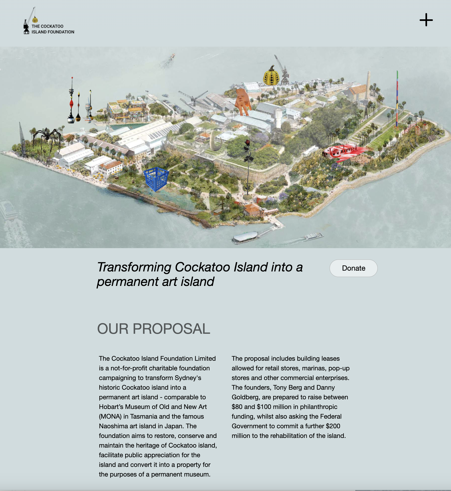
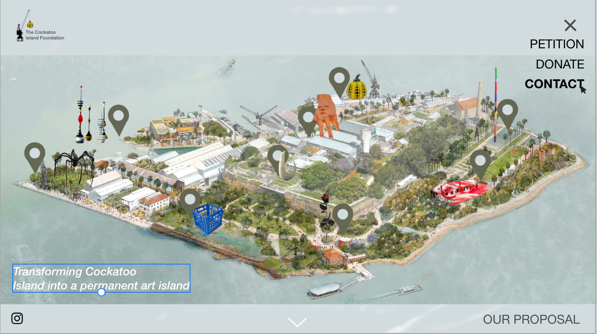
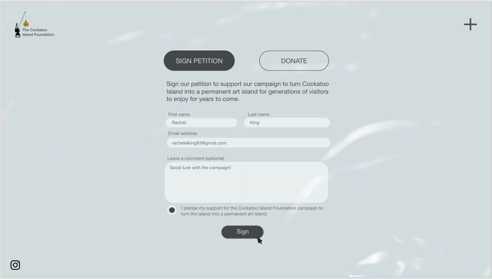
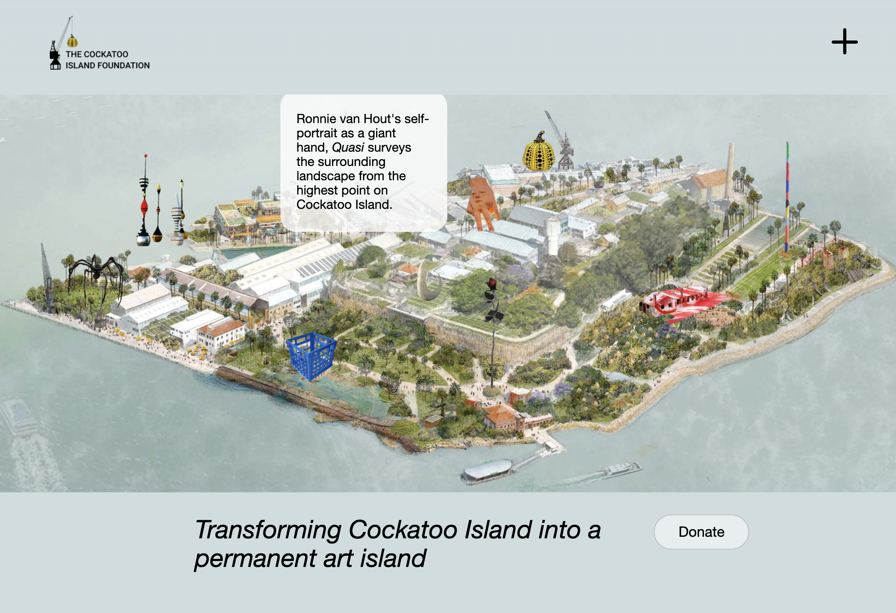
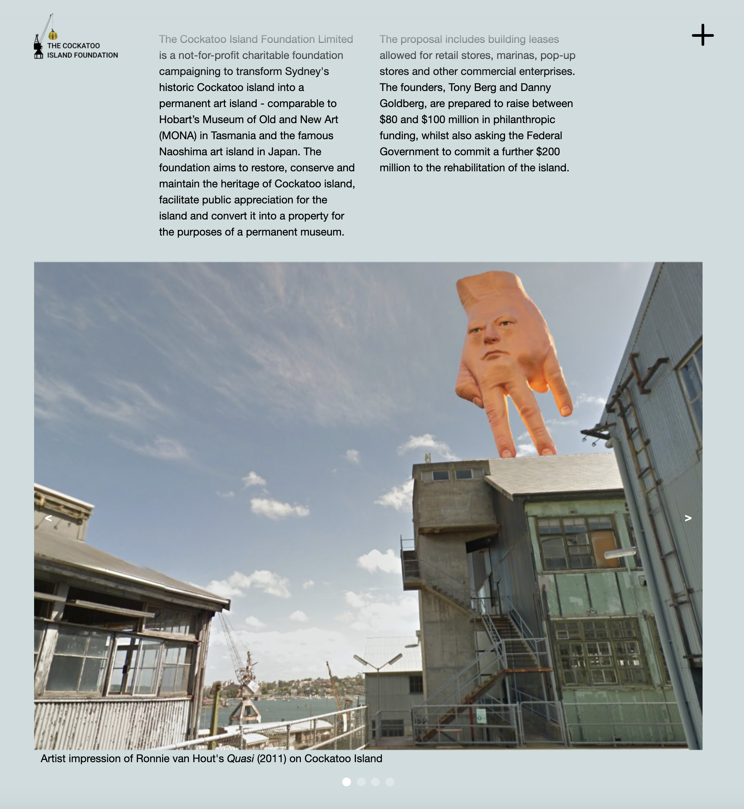
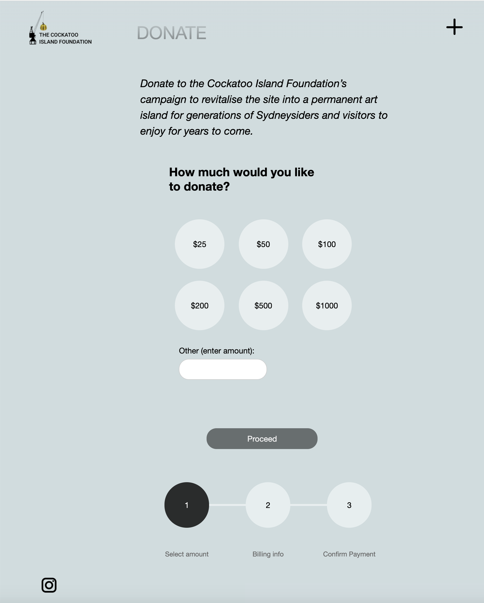
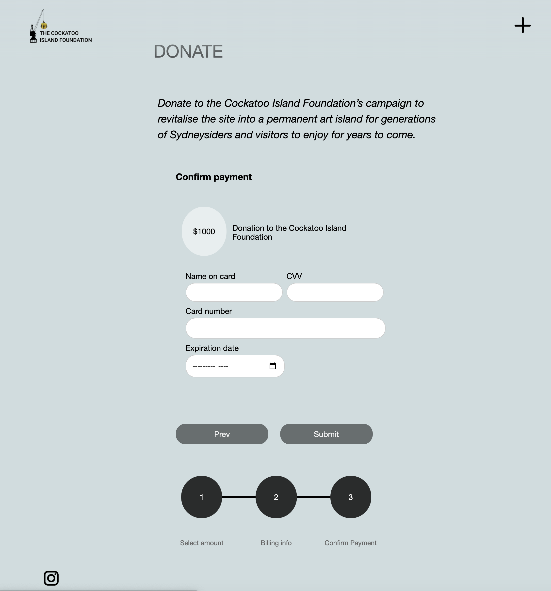
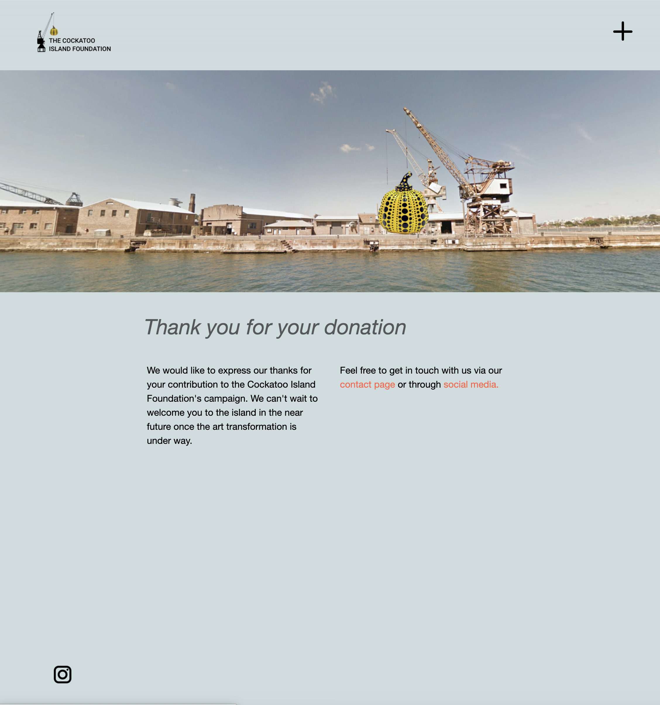
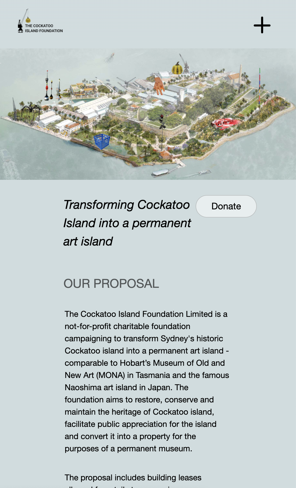
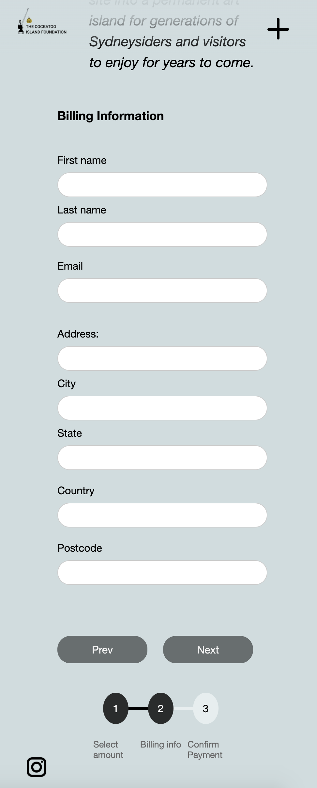

# The Cockatoo Island Foundation web design project
Rachel King

**Design brief:** To develop a website that helps the Cockatoo Island Foundation communicate directly with the public, raise awareness about their campaign and enable supporters to donate to the foundation via an online form.

## Reflection

During the prototyping phase of the project, I worked on transferring my design into a more effective and user-friendly layout.

I decided to align my headings and content to the centre of the canvas with two gutters either side, so that users don't have to read across the entire screen (especially on large monitors). This helps to improve the readability of the site in accordance with web design best practices.

**Figure 1:** Landing page of Cockatoo Island Foundation prototype

**Figure 2:** Landing page of Cockatoo Island Foundation initial design in XD

During one of the workshop sessions, a tutor suggested adding a background to my menu to improve legibility and he also pointed out that some of my text is not easy to read as it overlaps the island image. Therefore, I adjusted my headings in the prototype so that they don't overlap the image to ensure legibility.

I also added a white background to the slide in menu and I introduced another colour to the colour palette (#FF6347) which is a dark orange colour (called tomato) that complements the predominanlty blue colour scheme of the website. I introduced this colour on some anchor tags (shown here and on the Contact Us page) to make them pop out from the page and catch the user's attention.

**Figure 3:** Updated slidein menu on prototype

It is also worth pointing out that I used purely HTML and CSS for the slide in menu. I am aware that this is a 'hacky' method but it is effective in getting across my idea in the prototype - given that we have only learnt HTML and CSS in this course this semester. If I developed this website further, I would use javascript to implement the menu in accordance with web design best practices.

The image above also shows a slight gradient at the top of the screen. I used a gradient on the navigation header at the top of the screen to ensure that the logo and plus menu stay visible at all times as the user scrolls.

**Figure 4:** Initial design with two CTAs

In my initial design, I had two call-to-actions that were revealed as the user scrolled down the main page (i.e. donate and sign the petition). The CTAs had equal weighting within the visual hierarchy which may be confusing for users, as it dilutes the aim of the website (i.e. to raise funds for the campaign).

In the prototyping phase I decided to focus on one call-to-action (i.e. donate) and make it more visible and accessible to the user by placing it at the top of the landing page (just below the map of Cockatoo Island). This means that users are more likely to see the call-to-action and click on it without having to scroll down the page. Furthermore, if users only visit the website briefly (without exploring the other pages), they will still be aware of the aim of the Cockatoo Island Foundation to raise money for their campaign.

**Figure 5:** Interactive loading page with acknowledgement of country

In my initial design, I also had an interactive ripple background on each page of the site. However, in retrospect I realised that this might be distracting for users when reading the content on the microsite (or it might not work in some browsers) and therefore I limited it to the page on entry. This means that the website will still have appeal for users interested in an interactive art experience (as developed in my user profiles in Assessment 3).

This page shows the acknowledgement of country, which in my initial design was in a modal box on top of the island when users enter the landing/main page. However, I decided to change the location of the acknowledgement of country because personally I find it a little disrespectful to close a popup box with an acknowledgement of country by hitting a cross (as though cancelling it out) and therefore I think it is a little more courteous to have it above an 'enter' button instead.

**Figure 6:** Interactive map of Cockatoo Island in prototype

In my original design, I created an interactive map showing various 
public artworks around Cockatoo Island. I implemented this using CSS to achieve hoverable icons. However, I found that the popup boxes could be quite cluttered in a small window so I decided to limit this function to screens above 480px. This means that the website will be easily read on mobile screens without popup boxes obscuring the other content of the page from view.

**Figure 7:** Original design showing pop-up boxes on mobile screens

In the prototype, I also simplified my design of the sliding gallery. Instead of showing the other images in the background, I decided to use a series of dots which would indicate to the user how many images there are in the gallery and which of those is currently in view. This helps users to navigate easily through the site on both mobile and desktop devices.

**Figure 8:** Image gallery in prototype

**Figure 9:** Donation form in prototype

On the first page of the donation form in the prototype I added an extra input box so that users can enter an amount that they would like to contribute to the foundation and this helps improve the usability of the form - by giving users more control over their interaction.

I also tweaked the colours of the form to make a greater contrast between the input fields and buttongs versus the background so that they are more visible to users. My aim is to create a microsite that is accessible to a range of users of all different abilities and therefore adequate contrast is important.

**Figure 10:** Donation form in prototype

Following my tutor's suggestion, I also added a 'Thank you' page to the end of the form that appears when users click the submit button. This helps to improve the user journey by showing gratitude for the user's donation and interaction with the foundation's website. This will also mean that donors will leave the site with a positive feeling - rather than feeling as though their donation was not appreciated.

**Figure 11:** Thank you page in prototype

During the prototyping phase, I also worked on making my site responsive for mobile devices by using flexboxes to wrap the content and changing font sizes based on the screen width (using media queries).

**Figures 12-13:** Mobile layouts in prototype

## User testing

I conducted a small number of user tests on friends and family members interested in the arts. The participants found the website easy to navigate and were particularly drawn to the main logo (i.e. a crane holding up a Yayoi Kusama pumpkin) and the interactive nature of the site. On reflection, I would like to develop this website further by enhancing the interactive and playful elements of the design and perhaps expanding the scope of the project to be more about an interactive art museum - alongside the charitable purpose of the site. I would also like to continue improving the layout of elements to enhance the responsiveness of the site across all browsers.
